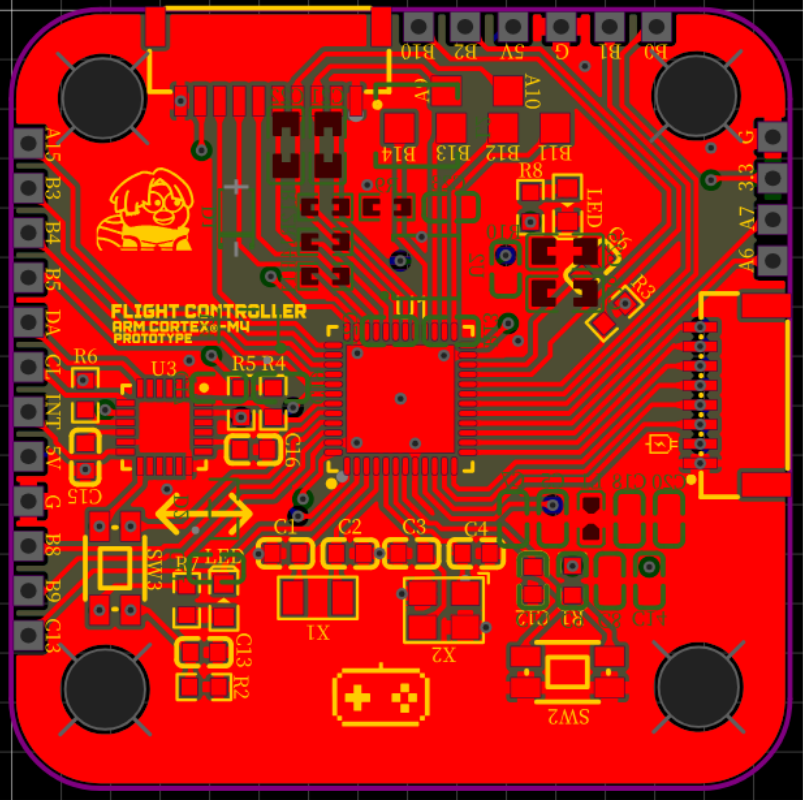
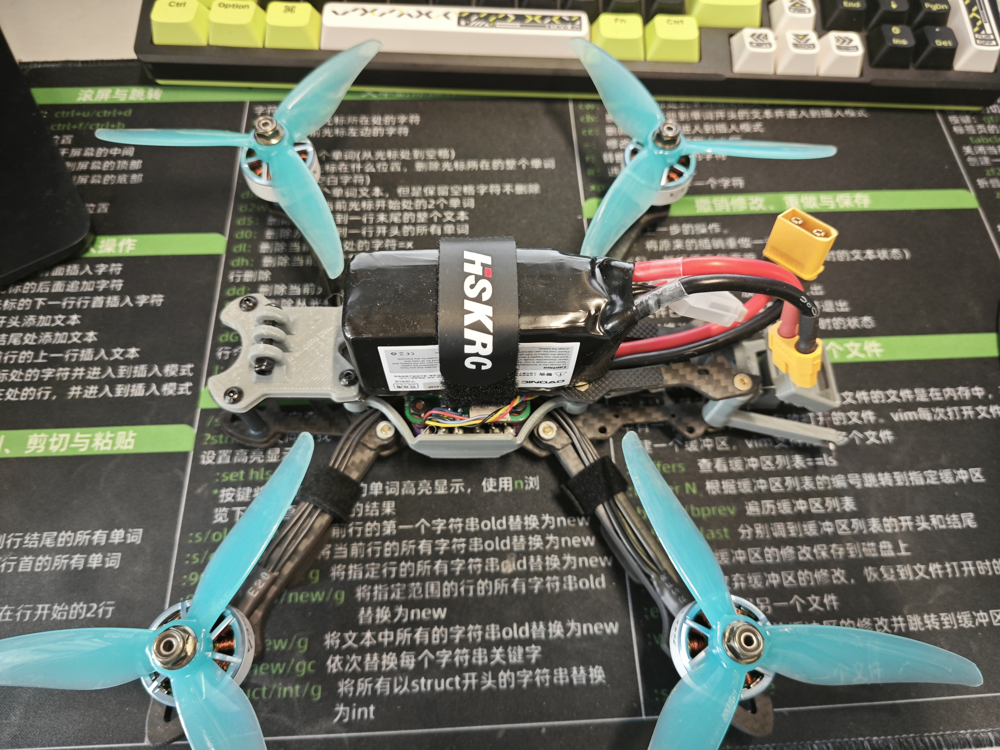

# FightController	四轴无人机控制器

> 该库存放自制四轴无人机控制器项目代码

## 硬件

### 集成控制板

- #### 控制器/MCU

​	STM32F411CEU6

- #### 六轴传感器

​	MPU6050

### 接收机

​	开源方案；CRFS协议

### 电调

​	适配协议：dshot协议

## 软件

### 飞控算法

串级PID（外环P，内环PID）

### 两种模式

1. 自稳模式（姿态摇杆输入为**期望倾斜角**）
   - 该模式下，遥控器（姿态摇杆）输入的是飞行器的期望倾斜角度
     - 姿态摇杆回中时，飞行器**姿态改平**
2. 手动模式（姿态摇杆输入为期望**倾斜角速度**）
   - 该模式下，遥控器（姿态摇杆）输入的是飞行器的期望倾斜**角速度**
     - 姿态摇杆回中时，飞行器**稳定在当前姿态**

### 一键锁定

触发后，飞行器螺旋桨马达停转

## 自制PCB图

## 无人机成品图

